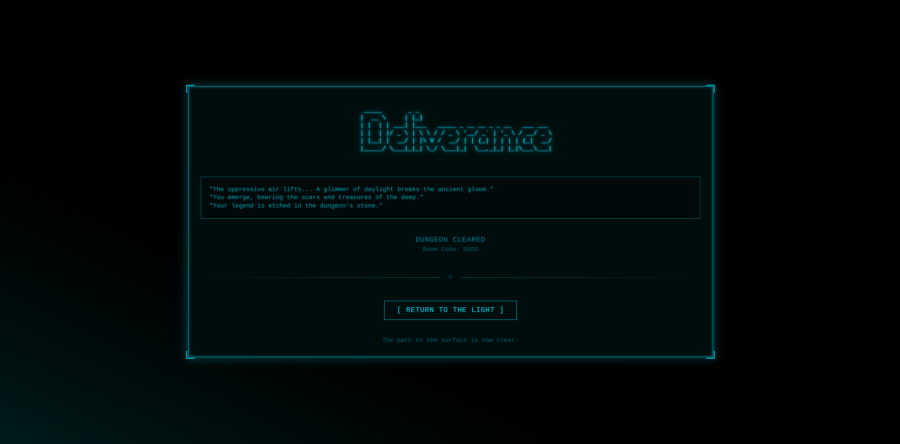

# Real-Time Multiplayer Roguelike Frontend

This repository contains the complete frontend client for a cooperative, real-time multiplayer roguelike game. Built with React and styled with Tailwind CSS, this interface provides a clean, responsive, and thematic window into the treacherous, procedurally generated dungeons managed by the backend server.

---

## Gameplay Features & User Experience

This client is designed to deliver a seamless and intuitive roguelike experience, allowing players to focus on strategy, exploration, and survival.

### Simple & Thematic UI
- **Clean Interface:** A minimal, retro-inspired UI keeps the focus on the gameplay without unnecessary clutter.
- **Responsive Design:** Enjoy the full experience on any screen size, from desktop monitors to mobile devices.
- **Thematic Elements:** Custom-styled lobby, victory, and defeat screens create an immersive atmosphere from the moment you launch the game.

### Real-Time Cooperative Gameplay
- **Create or Join Instantly:** Jump into a new adventure by creating a 4-letter room code, or join an ongoing expedition with your friends.
- **Live State Updates:** The UI reflects the game state in real-time, showing player health, monster positions, and inventory changes as they happen.
- **Spectator Mode:** If you fall in battle, you can continue to watch your teammates as they fight for survival.

### Tactical Turn-Based Action
- **Intuitive Controls:** Simple keyboard commands (`WASD` for movement, `E` to equip, `G` to grab) make the game easy to pick up and play.
- **Controller Support:** Seamless plug-and-play controller support allows for a classic gamepad experience.
- **Visual Feedback:** A glowing indicator highlights your character, while a red targeting beam clearly shows the path of ranged attacks.
- **Fog of War:** The map dynamically reveals itself as you explore, with the server calculating each player's unique line-of-sight.
---


## Gameplay Showcase





---

## How to Run Locally

The backend server must be running for the game to connect.

```bash
# 1. Clone the repository
git clone https://github.com/Ankritjarngal/Dungeon-Crawler-Frontend
cd Dungeon-Crawler-Frontend

# 2. Install dependencies
npm install

# 3. Run the development server
npm run dev
